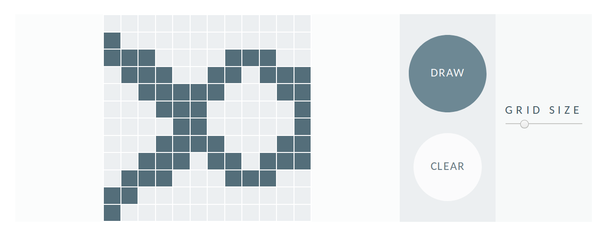

# Etch-A-Sketch
---
A browser implementation of an Etch-a-Sketch.

Inspired by and written as a solution to the practice project
[Etch-a-Sketch](https://www.theodinproject.com/courses/web-development-101/lessons/etch-a-sketch-project) by the Odin Project

---
## How-to-Use

+ Press the `DRAW` button to enter drawing-mode, and hover over the grid to mark the squares. Press the `DRAW` button again to stop drawing.

+ Press the `CLEAR` button to clear the grid. 

+ Enter a number from 2 to 64 in the number input to change the number of squares on the grid
*(This will also clear any squares that have been marked).*

